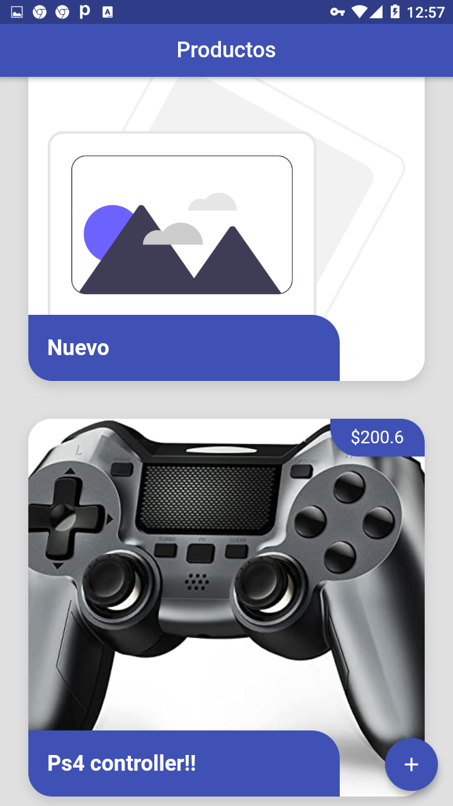
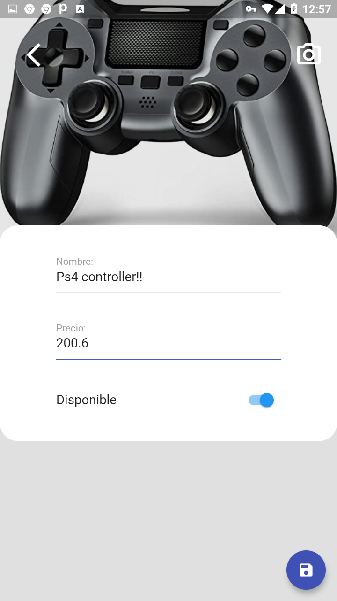

<h1 align="center">
  Products app
</h1>

<h2 align="center">
  
  
  
</h2>

<br />

## Used Packages

- provider: ^6.0.0
- http: ^0.13.3
- image_picker: ^0.8.3+3
- flutter_secure_storage: ^4.2.1

## Resources

- Firebase

## How to run

1. First clone the repo:

```bash
git clone https://github.com/alcampospalacios/flutter_products_shop.git
```

<br />

2. In the repo path:

```bash
flutter pub get
```

<br />

3. And finally:

```bash
flutter run
```
